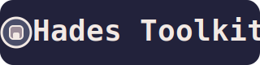

```
██╗░░██╗░█████╗░██████╗░███████╗░██████╗  ████████╗░█████╗░░█████╗░██╗░░░░░██╗░░██╗██╗████████╗
██║░░██║██╔══██╗██╔══██╗██╔════╝██╔════╝  ╚══██╔══╝██╔══██╗██╔══██╗██║░░░░░██║░██╔╝██║╚══██╔══╝
███████║███████║██║░░██║█████╗░░╚█████╗░  ░░░██║░░░██║░░██║██║░░██║██║░░░░░█████═╝░██║░░░██║░░░
██╔══██║██╔══██║██║░░██║██╔══╝░░░╚═══██╗  ░░░██║░░░██║░░██║██║░░██║██║░░░░░██╔═██╗░██║░░░██║░░░
██║░░██║██║░░██║██████╔╝███████╗██████╔╝  ░░░██║░░░╚█████╔╝╚█████╔╝███████╗██║░╚██╗██║░░░██║░░░
╚═╝░░╚═╝╚═╝░░╚═╝╚═════╝░╚══════╝╚═════╝░  ░░░╚═╝░░░░╚════╝░░╚════╝░╚══════╝╚═╝░░╚═╝╚═╝░░░╚═╝░░░

═══════════════════════════════════════════════════════════════════════════════════════════════
🔥 HADES TOOLKIT - Underworld Hacking Arsenal 🔥
═══════════════════════════════════════════════════════════════════════════════════════════════
⚔️  Master the Dark Arts of Cybersecurity  ⚔️
═══════════════════════════════════════════════════════════════════════════════════════════════
📷 Instagram: Prathi_hades
```

# Hades Toolkit

## What is Hades Toolkit?
Hades Toolkit is a collection of 33+ cybersecurity, OSINT, and automation tools for ethical hacking, research, and learning. Every tool has a consistent, easy-to-use UI and is designed for legal, educational use only.

---

## Features
- Phone number OSINT
- IP address tracing
- Port scanning
- WiFi password cracking (requires aircrack-ng)
- Web vulnerability scanning
- System info gathering
- DNS and WHOIS lookup
- Password strength checker & generator
- Hash generator
- QR code generator
- Virus scanner
- File encryptor/decryptor
- Social media OSINT
- SMS bomber (for testing)
- And many more!

---

## Step-by-Step Installation

### 1. Clone the repository
```sh
git clone https://github.com/prathi0558e/hades-toolkit.git
cd hades-toolkit
```

### 2. (Recommended) Create a Python virtual environment
```sh
python3 -m venv active
source active/bin/activate
```

### 3. Install all requirements
```sh
pip install -r requirements.txt
```

If you see errors about Tkinter, run:
```sh
sudo apt-get install python3-tk
```
If you see errors about PyQt5, run:
```sh
pip install PyQt5
```
If you use WiFi tools, install aircrack-ng:
```sh
sudo apt-get install aircrack-ng
```

---

## How to Use

1. Start the toolkit:
   ```sh
   python main.py
   ```
2. You will see a menu with all available tools. Enter the number of the tool you want to use.
3. Each tool will show a banner and guide you step-by-step.

---

## Requirements
- Python 3.6+
- All packages in `requirements.txt` (see above)
- For WiFi tools: root privileges and aircrack-ng

---

## Troubleshooting
- **Missing package error?** Run: `pip install -r requirements.txt`
- **Tkinter error?** Run: `sudo apt-get install python3-tk`
- **PyQt5 error?** Run: `pip install PyQt5`
- **WiFi tool error?** Run: `sudo apt-get install aircrack-ng` and use with root
- **Other issues?** Check your Python version and permissions

---

## Learning Path: From Beginner to Advanced

Whether you're new to cybersecurity or already experienced, Hades Toolkit helps you learn by doing. Each tool is designed to teach you a real-world skill:

- **Phone number OSINT**: Learn how attackers gather info from public sources.
- **IP address tracing**: Understand geolocation and network mapping.
- **Port scanning**: Discover how to find open ports and services.
- **WiFi password cracking**: See how wireless security works (and how to defend it).
- **Web vulnerability scanning**: Learn about common web flaws and how to spot them.
- **System info gathering**: Know what info is exposed on a device.
- **DNS/WHOIS lookup**: Explore how domains and IPs are registered and resolved.
- **Password tools**: Practice creating and testing strong passwords.
- **Hash generator**: See how data is protected and verified.
- **QR code generator**: Learn about secure device pairing and data sharing.
- **Virus scanner**: Understand basic malware detection.
- **File encryptor**: Try out file protection and cryptography.
- **Social media OSINT**: See how profiles can be found and analyzed.
- **SMS bomber**: Test rate-limiting and anti-abuse protections.

### Tips for Beginners
- Start with info-gathering tools (phone, IP, DNS, WHOIS).
- Use password tools to learn about password strength.
- Try web vulnerability scanning on your own test sites.
- Always get permission before scanning or testing any system!

### Tips for Advanced Users
- Customize or extend any tool (Python source code is open).
- Integrate with other frameworks or automation scripts.
- Use the virus scanner and file encryptor for real-world security practice.
- Contribute new tools or improvements via pull requests.

### Learn More
- [OWASP Top 10 Web Vulnerabilities](https://owasp.org/www-project-top-ten/)
- [Cybrary Free Security Courses](https://www.cybrary.it/)
- [Hack The Box Labs](https://www.hackthebox.com/)
- [Aircrack-ng Documentation](https://www.aircrack-ng.org/doku.php?id=main)
- [Python Security Resources](https://realpython.com/python-security/)

---

## Ethical Hacking & Legal Notice
This toolkit is for learning and authorized testing only. Never use it on systems/networks without explicit permission. Unauthorized access is illegal and unethical.

---

## Contributing
Pull requests and issues are welcome! Help make Hades Toolkit better for everyone.

---

## License
MIT License

---

## Author
Prathish Kumar 
Final year student 
B.tech Information college 

---

For help, open an issue or contact the maintainer.